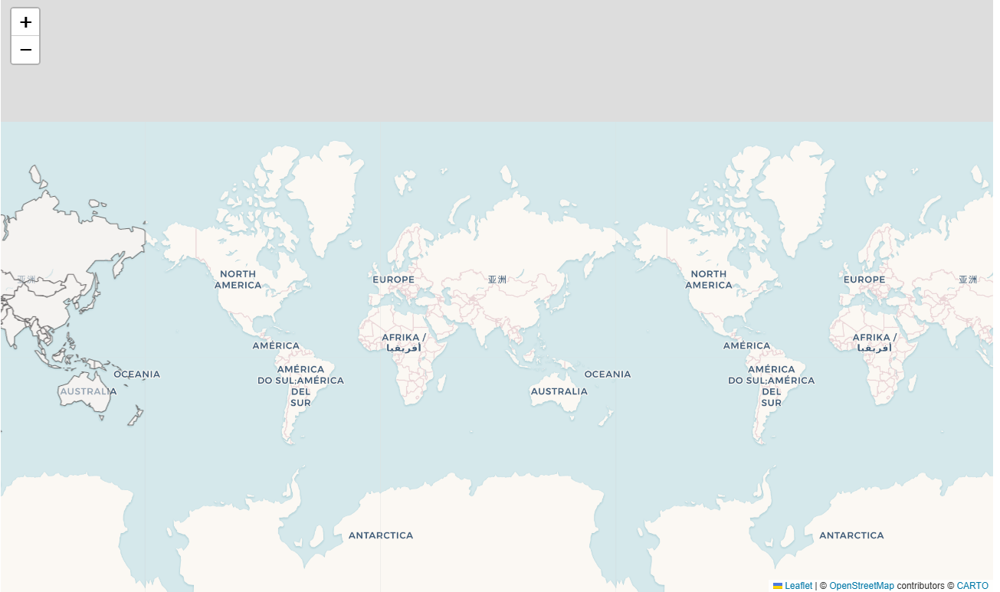
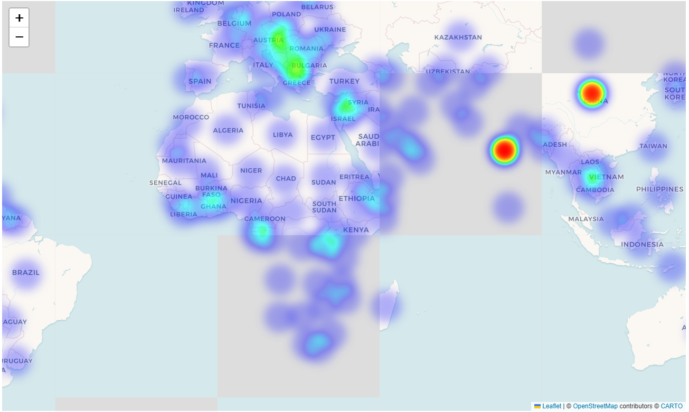
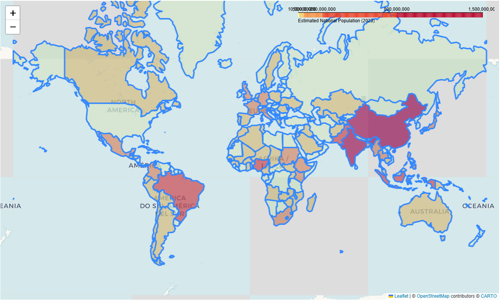

**Global Country Population Geospatial Visualization**
Interactive geospatial visualization built with Geopandas & Folium for world population distribution analysis.

**Project Description**
This repository provides an end-to-end geospatial data workflow:
Load & preprocess vector geospatial data (country boundary GeoJSON) via Geopandas
Merge World Bank population tabular CSV with geographic polygons
Calculate accurate geographic centroids (convert projected centroid back to WGS84 latitude/longitude)
Generate 3 types of interactive web maps with Folium:
Marker Point Map: Independent marker for each country with population popup
Weighted Heatmap: Visualize population density hotspots globally
Choropleth Map: Region color grading based on total population size
Export all interactive maps as standalone HTML files (openable without Python environment)
All code is fully annotated, compatible with Jupyter Notebook, and optimized for academic geospatial learning.

**Dataset Source**
World Country Boundary GeoJSON
Source: https://github.com/johan/world.geo.json
Coordinate System: WGS84 (EPSG:4326)
World Bank Total Population Dataset (SP.POP.TOTL)
Source: https://datahub.io/core/population
Columns: Country Name, Country Code, Year, Value
Unit of Value: Thousand people

**Environment Installation**
pip install -r requirements.txt

**Core Workflow**
Import libraries & suppress geospatial coordinate warnings
Load country boundary GeoJSON and population CSV
Filter single-year population data (2023) and rename columns for table merge
Merge tabular population data into geodataframe by country name
Calculate projected centroid and convert back to WGS84 lat/lon (avoid meter coordinate error)
Filter out Antarctica & invalid geographic records
Build 3 interactive Folium maps with independent styling
Export all HTML maps to output folder

**Visualization Output Introduction**
1. Marker Point Map
Each country centroid is marked with blue info icon. Click marker to check country name and total population. Suitable for discrete location browsing.
2. Population Heatmap
Heat layer weighted by population value. Brighter red color represents denser human settlement. Clearly identifies high-population regions (East Asia, South Asia, Western Europe).
3. Choropleth Graded Color Map
Countries filled with yellow-orange-red gradient based on population bins. Hover over polygon to view real-time country & population data. Grey color for countries missing population records.
Data Insights from Visualization
Population hotspots concentrate in East Asia, South Asia and Western Europe; Sahara, Siberia, Central Australia show extremely low population density.
China and India hold the highest population tiers with deepest fill color on choropleth map.
Large territory countries (Canada, Australia, Russia) have sparse population markers and weak heat signals despite vast land area.

# Global Population Timeseries Map Demo

**World_Country_Map**

**World_Population_Heatmap**

**World_Population_Choropleth**

**Usage Notes**
Country name mismatches may cause empty population values; use Country Code for higher matching accuracy if needed.
All exported HTML maps support pan, zoom and layer toggle controls.
Projection EPSG:8859 (World Equal Area) is used for centroid calculation to eliminate spherical distortion, then converted back to WGS84 for Folium display.

**License**
MIT License
